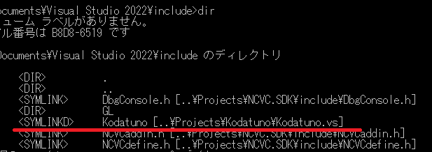

# NCVC ビルド方法

## Boost C++ Library
Boost C++ Library をビルドしておいてください．
boost::regex を使用しているのでビルドが必要です．
参考までにビルド用のバッチファイルを以下に示します．

    set BOOST=boost_x_xx_x
    
    cd %BOOST%
    call bootstrap.bat
    bjam toolset=msvc address-model=32 --build-type=complete --stagedir=stage/x86 -j 16
    bjam toolset=msvc address-model=64 --build-type=complete --stagedir=stage/x64 -j 16
    
    cd ..
    rmdir boost
    mklink /D boost %BOOST%

バージョンが変わってもプロジェクトの設定（インクルードファイルやライブラリのパス）を変更しなくて済むように，
シンボリックリンクを作ります．
mklink コマンドだけ管理者権限でないと動かないのでご注意ください．

## GLEW
<http://glew.sourceforge.net/> から Windows 32-bit and 64-bit の Binaries をダウンロードしていただき，
インクルードファイルとライブラリファイルを適切に設置してください．

## Kodatuno
NCコードのシミュレーションにおいて，3Dワークデータと重ねる機能
(WorkFile=hoge.igs)
のIGESファイル読み込みに，金沢大学マンマシン研究室で開発されている Kodatunoライブラリを使用しています．
NCVC用に若干の修正を加えてビルドしているので，stdafx.h の

    #define USE_KODATUNO

をコメントアウトしてください．
フルビルドに際しては，Kodatunoライブラリはオープンソースで開発されているので，僕が修正したパッチの公開か，何かしらの方法を検討します．
KodatunoさんがGitHubで公開されることを願います．  
なお，feature_Kodatunoブランチに関して，Kodatunoライブラリを利用して3Dの切削データを生成する機能を実装実験中です．
こちらのブランチをビルドするにはKodatunoライブラリが必須となります．

Kodatunoライブラリのビルド方法は <https://github.com/NCVC-CAM/Kodatuno/blob/main/README.md> を参照してください．
NCVC プロジェクトから見えるところに Kodatuno.vs.lib をコピー（またはシンボリックリンク）してもらえればOKです．
インクルードファイルも同様です．僕は下図のようにKodatunoフォルダごとシンボリックリンクを張っています．

